# epkv

An experimental distributed key-value database using EPaxos protocol.

epkv uses a modified version of epaxos protocol for distributed consensus. A detailed explanation is coming soon.

## Architecture

